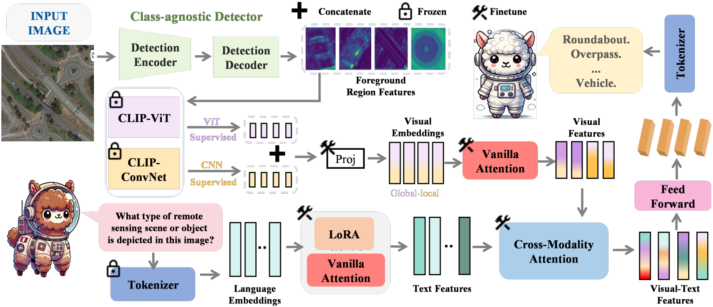

<h1 align="center">☀️LLaMA-Unidetector☀️</h1>

<h3 align="center" style="font-family: 'Times New Roman'; font-size: 10px;">
LLaMA-Unidetector: A LLaMA-Based Universal Framework for Open-Vocabulary Object Detection in Remote Sensing Imagery
</h3>

<p align="center">
Jianlin Xie<sup>1</sup>, Guanqun Wang<sup>2</sup><sup>*</sup>, Tong Zhang<sup>1</sup>, Yikang Sun<sup>1</sup>, He chen<sup>1</sup>, Yin Zhuang<sup>1</sup>, Jun Li<sup>3</sup>
</p>

<p align="center">
<sup>1</sup> Beijing Institute of Technology, <sup>2</sup> Peking University, <sup>2</sup> China University of Geosciences
</p>

<h2 style="font-family: 'Times New Roman'; font-size: 15px;">🔥Updates</h2>

- 🗓️**May 5th, 2025**: The LLaMA-Unidetector repo has been further optimized.

<h2 style="font-family: 'Times New Roman'; font-size: 15px;">🎯Overview & Contribution</h2>



Our main contributions are:
- 1) We introduce a novel open-set benchmark for remote sensing, accompanied by a self-built Vision Question Answering (VQA) remote sensing dataset, TerraVQA, providing a platform for researchers to explore open-vocabulary object detection tasks in remote sensing imagery.
- 2) We propose a class-agnostic detector that eliminates multi-class dependencies while explicitly modeling both geometric and probabilistic aspects of object detection, enabling the localization branch to learn general spatial representations and achieve strong generalization across diverse scenarios and unseen object categories.
- 3) We propose a LLaMA-based multimodal large language model without class vocabulary limitations that offers superior semantic understanding and the flexibility to handle novel concepts beyond the vocabulary.

<h2 style="font-family: 'Times New Roman'; font-size: 15px;">
🧾Getting Started
</h2>

<h3 style="font-family: 'Times New Roman'; font-size: 15px;">
1. Installation
</h3>

DECOR is developed based on python==3.9.11 torch==1.11.0 and torchvision==0.12.0. Check more details in requirements.

<h3 style="font-family: 'Times New Roman'; font-size: 15px;">
i. Clone Project
</h3>

```
git clone https://github.com/ChloeeGrace/LLaMA-Unidetector.git
```

<h3 style="font-family: 'Times New Roman'; font-size: 15px;">
ii. Install
</h3>

```
pip install -r requirements.txt
```

<h3 style="font-family: 'Times New Roman'; font-size: 15px;">
2. Data Preparation
</h3>

**VQA dataset**.

<h2 style="font-family: 'Times New Roman'; font-size: 15px;">🔔Notice</h2>

We will release our code and VQA dataset to support future research in remote sensing open-vocabulary object detection.

<h2 style="font-family: 'Times New Roman'; font-size: 15px;">📢Contact</h2>

If you have any questions, suggestions or spot a bug, feel free to get in touch. We would also love to see your contributions. Just open a pull request if you'd like to help out. Thanks so much for your support!

